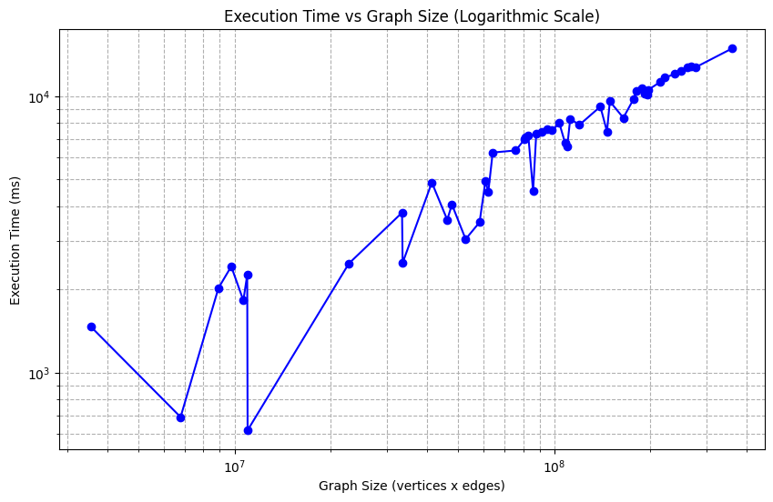

## Para rodar o código:
```bash
make run
```

## O problema

Dado um grafo G = (V, E), determinar o maior subconjunto de aresta, E′ ⊆ E,
que formam um casamento. Ou seja, nenhum aresta de E′
compartilham v´ertices
em comum;

## Definições

### Casamento
Dado um grafo, um casamento (também conhecido como emparelhamento ou
matching) é um conjunto independente de arestas, ou seja, um conjunto de
arestas sem vértices em comum.


### Casamento Máximo e Maximal
Um casamento é considerado maximal caso a adição de alguma aresta
descaracterize o casamento.
Um casamento é considerado máximo caso possua o maior número de arestas
possível, ou seja, caso seja o maior casamento possível no grafo


#### Para nosso caso específico
https://en.wikipedia.org/wiki/Maximum_cardinality_matching#:~:text=for%20bipartite%20graphs-,Flow%2Dbased%20algorithm,of%201%20to%20each%20edge

https://en.wikipedia.org/wiki/Blossom_algorithm

https://depth-first.com/articles/2019/04/02/the-maximum-matching-problem/#:~:text=Blossoms,published%20by%20Micali%20and%20Variani.

Número máximo de vértices em um grafo não-orientado e sem loops: V(V-1)/2.

Faixa de tamanho de vértices e arestas nos grafos gerados: 2^14.

Exception in thread "main" java.lang.OutOfMemoryError: Java heap space


Gráfico com 15 grafos mostrando a relação entre o tamanho do grafo e o tempo de execução em escala logarítmica, com os pontos ordenados de forma monótona pelo tamanho do grafo. Intervalo entre 10 e 15.

Com 50 grafos:

Intervalo entre 10 e 15

Com 50 grafos, intervalo de 0 a 20000 vértices e arestas:

